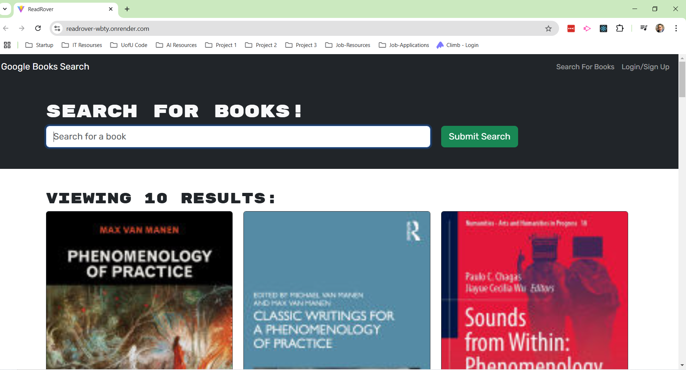

# ReadRover

[](https://opensource.org/licenses/MIT)

  

[GitHub Repository](https://github.com/keithamadeus/ReadRover)

[Deployed Link](https://readrover-wbty.onrender.com/)



## Description

This project focuses on where I transformed a typical RESTful API-driven book search engine into a more efficient and flexible GraphQL-powered application. The original setup was built using the MERN stack, encompassing MongoDB, Express.js, React, and Node.js. My goal is to enhance the application's performance and user experience by leveraging GraphQL's ability to query exactly what's needed.

As an avid coder and reader, I wanted to create a tool that would not only allow users to search for books but also personalize their reading lists effectively. By moving from REST to GraphQL, I aimed to make the application more responsive to evolving user demands and data interactions, providing a seamless experience in managing and exploring book data. 

Though I faced some challenges, I managed to modify the authentication middleware to fit into the GraphQL framework, offering secure login and signup functionalities. 

Users can search for books using Google Books API, save their favorite books, and manage their reading list with options to save or remove books. 

The React frontend provides a user-friendly interface for searching, and I successfully deployed the application on Render, connecting it with MongoDB Atlas for database services.

## Table of Contents

- [Installation](#installation)

- [Usage](#usage)

- [Learning Points](#learning-points)

- [Author Information](#author-information)

- [Contributing](#contributing)

- [Tests](#tests)

- [License](#license)

## Installation
```
npm i
npm run build
npm run start:dev
```

## Usage

Enter a book title or keyword, and you'll get a list of books with their details like title, author, and a link to Google Books. 
Sign up or log in via a modal that toggles between these options
Once logged in, manage your saved books list, adding or removing books as you see fit. 
Logout: Easily log out to secure your account.  

## Learning Points

I learned firsthand the benefits of GraphQL in terms of flexibility and efficiency in data handling, although it came with its learning curve, especially in integrating with existing authentication systems. 

Deploying with Render and MongoDB Atlas taught me about cloud service configurations and managing database connections in production. 

The sign-in/login feature was particularly tricky, teaching me valuable lessons in debugging and understanding middleware in a GraphQL context. 

This project was a great dive into modern web development practices, and despite some hurdles, I managed to refactor and enhance the application's core functionality successfully.

  

## Author Information

Keith Williams

  

## Contributing

N/A

## Tests

N/A

## License

This project is licensed under the MIT license.

https://opensource.org/licenses/MIT

  

## Questions

If you have any questions, you can reach me at keith.amadeus.williams@gmail.com.

You can also visit my GitHub profile at [keithamadeus](https://github.com/keithamadeus).